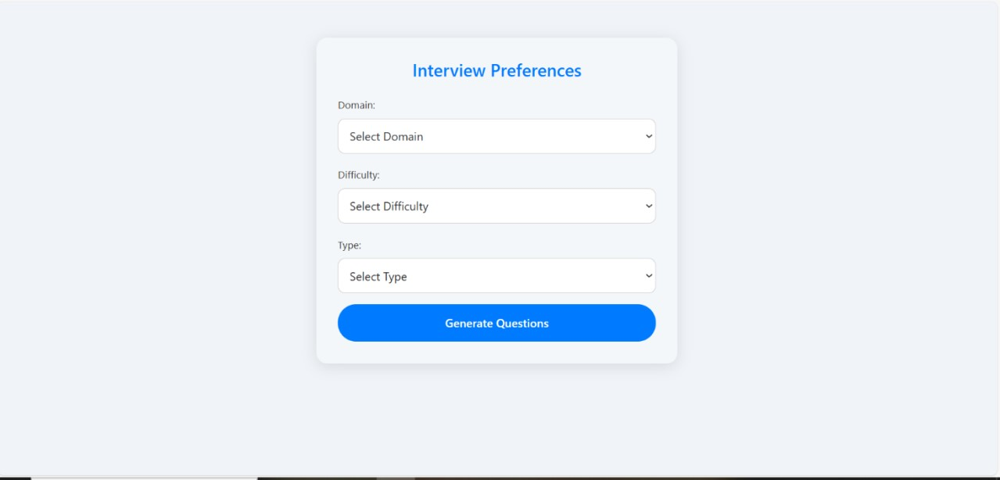
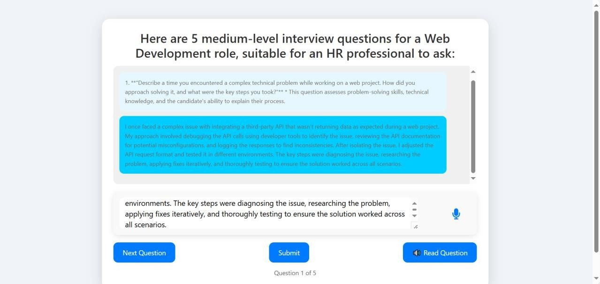
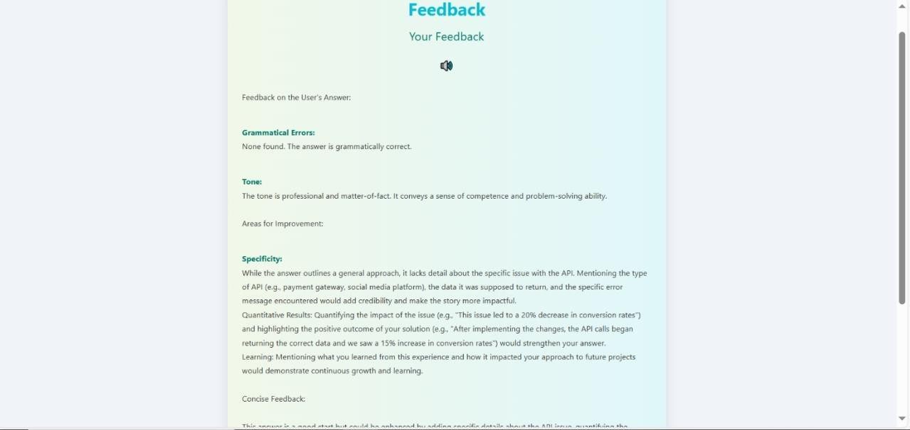
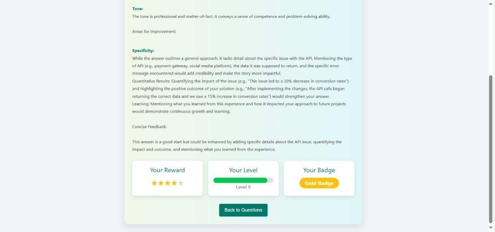

🎤 Virtual Job Interview Simulator

This project simulates a job interview process using AI-generated questions, real-time feedback, and voice input support. It helps users practice interviews in an interactive and realistic way.

--------------------------------------------------

🔧 Tech Stack

Frontend  
React.js, Bootstrap, JavaScript  

Backend  
Python, Django  

Database  
MySQL  

--------------------------------------------------

🚀 Features

• Dynamic interview question generation  
• Domain and difficulty selection  
• Voice and typing input support  
• AI-generated feedback and grading  

--------------------------------------------------

📁 Folder Structure

/job_interview_frontend – React frontend  
/job_interview_simulator – Django backend  
/images – Project screenshots  

--------------------------------------------------

🛠️ How to Run

Backend

```bash
cd job_interview_simulator
python -m venv venv
venv\Scripts\activate
pip install -r requirements.txt
python manage.py runserver
Frontend

cd job_interview_frontend
npm install
npm start
```
--------------------------------------------------

🖼️ APPLICATION PREVIEW

Domain Selection  


Interview


Feedback Screen   


